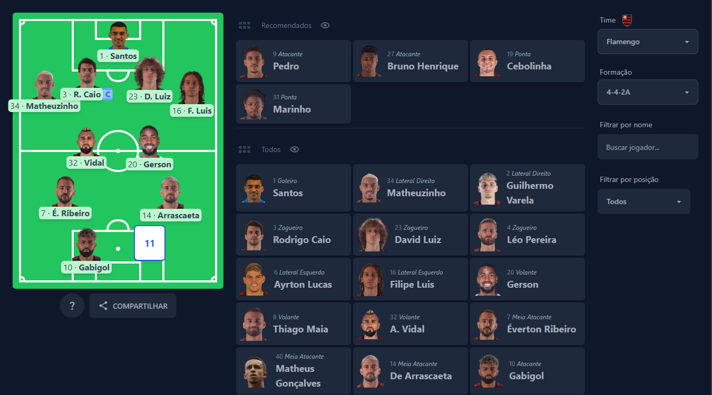

# FUT11

Build your formation.

1. Select a club.
2. Select your preferred formation.
3. Pick your players

- Clicking on Share you can:

* Click on camera icon to copy screenshot of the field to clipboard.
* Click on save to download the image to your disc.
* Click on Generate Link to get shortened link.

## Screenshot:

## PAGE: https://fut11.netlify.app/

### Build With:

- Tailwindcss ( daisyUI )
- React
- Typescript
- react-share, react-use-screenshot, react-icons
- vite, netlify

### I am proud of

- Turning idea into a real application.

### What I Learned:

- add new keys to object states
- take screenshot of a component and copy to clipboard
- absolute positioning elements

### Biggest difficulty:

- add new keys to object state
